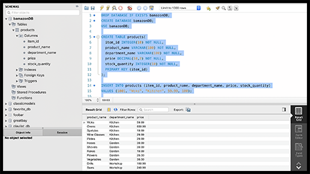

# Bamazon
CLI app

### Challenge #1: Customer View (Minimum Requirement)

1. Create a MySQL Database called `bamazon`.

2. Then create a Table inside of that database called `products`.

3. The products table should have each of the following columns:

* item_id (unique id for each product)

* product_name (Name of product)

* department_name

* price (cost to customer)

* stock_quantity (how much of the product is available in stores)

4. Populate this database with around 10 different products. (i.e. Insert "mock" data rows into this database and table).

*Screenshot of completed Bamazon database.*

5. Then create a Node application called `bamazonCustomer.js`. Running this application will first display all of the items available for sale. Include the ids, names, and prices of products for sale.

*Screenshot of Bamazon Customer app with available products listed.*

6. The app should then prompt users with two messages.
* The first should ask them the ID of the product they would like to buy.

*Screenshot of first message being displayed.*

* The second message should ask how many units of the product they would like to buy.

*Screenshot of selected product, stock quantiy and price.
And the second message being displayed.*

7. Once the customer has placed the order, your application should check if your store has enough of the product to meet the customer's request.

* If not, the app should log a phrase like `Insufficient quantity!`, and then prevent the order from going through.

*Screenshot of insufficient quantity message being displayed.*

8. However, if your store _does_ have enough of the product, you should fulfill the customer's order.

*Screenshot of order details message being displayed.*

* This means updating the SQL database to reflect the remaining quantity.
* Once the update goes through, show the customer the total cost of their purchase.

*Screenshot of completed order message being displayed.*

